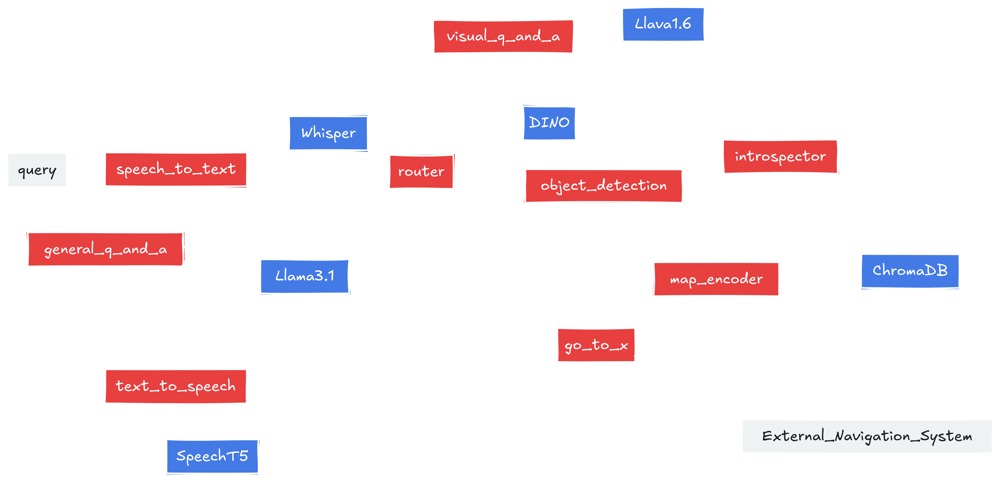

<div align="center">

<picture>
  <source media="(prefers-color-scheme: dark)" srcset="docs/_static/EMBODIED_AGENTS_DARK.png">
  <source media="(prefers-color-scheme: light)" srcset="docs/_static/EMBODIED_AGENTS_LIGHT.png">
  
</picture>

<br/>

Part of the [EMOS](https://github.com/automatika-robotics/emos) ecosystem

[](https://opensource.org/licenses/MIT)
[](https://www.python.org/downloads/)
[](https://docs.ros.org/en/humble/index.html)
[](https://discord.gg/B9ZU6qjzND)

**The production-grade framework for deploying Physical AI**

[**EMOS Documentation**](https://emos.automatikarobotics.com) | [**Developer Docs**](https://automatika-robotics.github.io/embodied-agents/) | [**Discord**](https://discord.gg/B9ZU6qjzND)

</div>

---

## What is EmbodiedAgents?

**EmbodiedAgents** is the intelligence layer of the [EMOS](https://github.com/automatika-robotics/emos) (Embodied Operating System) ecosystem. It enables you to create interactive, physical agents that don't just chat, but **understand**, **move**, **manipulate**, and **adapt** to their environment.

For full documentation, tutorials, and recipes, visit [emos.automatikarobotics.com](https://emos.automatikarobotics.com).

---

## Key Features

- **Production Ready** -- Robust orchestration layer built on native ROS 2. Deploy Physical AI that is simple, scalable, and reliable.

- **Self-Referential Logic** -- Agents that are self-aware. Start, stop, or reconfigure components based on internal or external events. Switch between cloud and local ML on the fly.

- **Run Fully Offline** -- Built-in local models for LLM, VLM, STT, and TTS. No server required. Optimized for edge devices and NVIDIA Jetson.

- **Spatio-Temporal Memory** -- Hierarchical spatio-temporal memory and semantic routing. Build arbitrarily complex graphs for agentic information flow.

---

## Quick Start

Create a VLM-powered agent that can answer questions about what it sees:

```python
from agents.clients.ollama import OllamaClient
from agents.components import VLM
from agents.models import OllamaModel
from agents.ros import Topic, Launcher

text0 = Topic(name="text0", msg_type="String")
image0 = Topic(name="image_raw", msg_type="Image")
text1 = Topic(name="text1", msg_type="String")

qwen_vl = OllamaModel(name="qwen_vl", checkpoint="qwen2.5vl:latest")
qwen_client = OllamaClient(qwen_vl)

vlm = VLM(
    inputs=[text0, image0],
    outputs=[text1],
    model_client=qwen_client,
    trigger=text0,
    component_name="vqa"
)

launcher = Launcher()
launcher.add_pkg(components=[vlm])
launcher.bringup()
```

---

## Run Fully Offline

Every AI component can run with a built-in local model -- no server, no cloud, no heavy frameworks. Just set `enable_local_model=True`:

```python
from agents.components import LLM
from agents.config import LLMConfig
from agents.ros import Topic, Launcher

config = LLMConfig(
    enable_local_model=True,
    device_local_model="cpu",  # or "cuda"
    ncpu_local_model=4,
)

llm = LLM(
    inputs=[Topic(name="user_query", msg_type="String")],
    outputs=[Topic(name="response", msg_type="String")],
    config=config,
    trigger=Topic(name="user_query", msg_type="String"),
    component_name="local_brain",
)

launcher = Launcher()
launcher.add_pkg(components=[llm])
launcher.bringup()
```

---

## Complex Component Graphs

Build arbitrarily sophisticated component graphs with self-reconfiguration based on events:

<div align="center">
<picture>
<source media="(prefers-color-scheme: dark)" srcset="docs/_static/complete_dark.png">
<source media="(prefers-color-scheme: light)" srcset="docs/_static/complete_light.png">

</picture>
</div>

## Dynamic Web UI

Every agent recipe generates a fully dynamic Web UI automatically. Built with FastHTML, it provides instant control and visualization without writing a single line of frontend code.

<div align="center">
<picture>

</picture>
</div>

---

## Installation

For detailed installation instructions, see the [EMOS Documentation](https://emos.automatikarobotics.com).

**Quick install (Ubuntu/Debian, ROS 2 Humble+):**

```bash
sudo apt install ros-$ROS_DISTRO-automatika-embodied-agents
```

**From source (for contributors):**

```bash
pip install numpy opencv-python-headless 'attrs>=23.2.0' jinja2 \
            httpx setproctitle msgpack msgpack-numpy \
            platformdirs tqdm websockets

git clone https://github.com/automatika-robotics/sugarcoat
git clone https://github.com/automatika-robotics/embodied-agents.git
cd ..
colcon build
source install/setup.bash
```

---

## Part of the EMOS Ecosystem

EmbodiedAgents is one of three core open-source components in [EMOS](https://github.com/automatika-robotics/emos) (Embodied Operating System) -- the unified orchestration layer for Physical AI:

- **[EmbodiedAgents](https://github.com/automatika-robotics/embodied-agents)** -- Intelligence and manipulation. ML model graphs with semantic memory and adaptive reconfiguration.
- **[Kompass](https://github.com/automatika-robotics/kompass)** -- Navigation. GPU-accelerated planning and control.
- **[Sugarcoat](https://github.com/automatika-robotics/sugarcoat)** -- Lifecycle management. Event-driven system design for ROS 2.

Write a recipe once. Deploy it on any robot. No code changes.

---

## Resources

- [EMOS Documentation](https://emos.automatikarobotics.com) -- Tutorials, recipes, and usage guides
- [Developer Docs](https://automatika-robotics.github.io/embodied-agents/) -- Architecture, custom components, API reference
- [Discord](https://discord.gg/B9ZU6qjzND) -- Community and support

## Copyright & Contributions

**EmbodiedAgents** is a collaboration between [Automatika Robotics](https://automatikarobotics.com/) and [Inria](https://inria.fr/).

The code is available under the **MIT License**. See [LICENSE](LICENSE) for details.
Copyright (c) 2024 Automatika Robotics unless explicitly indicated otherwise.
